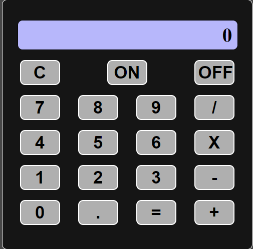

### Hi there 👋 Welcome to my space, where I post some code

<!--
**S-Pz/S-Pz** is a ✨ _special_ ✨ repository because its `README.md` (this file) appears on your GitHub profile.

Here are some ideas to get you started:

- 🔭 I’m currently working on ...
- 🌱 I’m currently learning ...
- 👯 I’m looking to collaborate on ...
- 🤔 I’m looking for help with ...
- 💬 Ask me about ...
- 📫 How to reach me: ...
- 😄 Pronouns: ...
- ⚡ Fun fact: ...
-->

🔭 I'm currently student of Computer Sience in UFSJ-Universidade Federal de São João Del Rei

🌱 I’m currently learning some  new programing languages like, C, Phyton, JavaScritp, CSS, HTML, PHP.

 

<a href="https://github.com/S-Pz">

 

## 🚀 Tecnologies

    

## 📝 Studying

## Calculadora JS

<a href= "https://github.com/S-Pz/SA_2">

 

 
    

</a>

## Projeto Integrador

